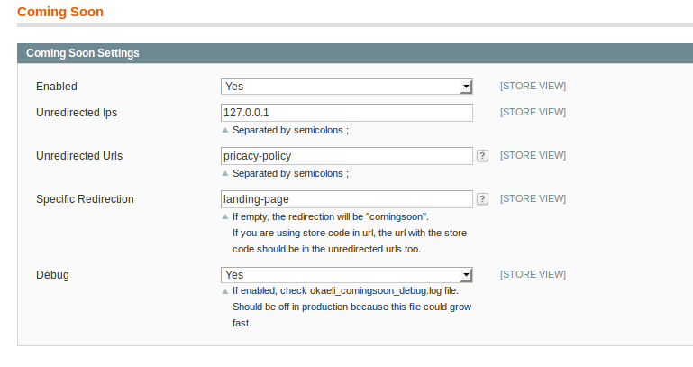

# Okaeli_ComingSoon

----------------------

```
@category   Okaeli  
@package    Okaeli_ComingSoon  
@author     Julien Loizelet <julienloizelet@okaeli.com>  
@copyright  Copyright (c)  2017 Julien Loizelet  
@license    GNU GENERAL PUBLIC LICENSE Version 3
  
```

## Description

`Okaeli_ComingSoon` is a Magento 1 extension that will redirect any visitor to a specific page.

## Installation

### Requirements

- Magento >= 1.6 (probably much earlier, but I didn't test)


### Modman

Run `modman link /path/to/your/clone/of/this/repo` at root of your Magento Project.

### Composer

In your `composer.json` file, add 
```
 {
"type": "vcs",
"url": "https://github.com/julienloizelet/magento1-comingsoon"
 }
``` 
in the `repositories` part and 
```
"okaeli/magento1-comingsoon":"dev-master"
```
in the `require` part.

## Usage


### Configurations

This module comes with some configurations : `System Config > Okaeli > Okaeli Coming Soon`

   * Enable / Disable feature.
   * Choose unredirected IPs
   * Choose unredirected URIs

   > You must add `/index.php/comingsoon` if your setting `System Configuration > Web > Search Engines Optimization > Use Web Server Rewrites
` is `No`.

   * Specific Redirection (by default, all url are redirected to `comingsoon`).
   * Enable / Disable debug log.



## Technical Notes

### No rewrite. Events driven development.

This extension is **0 rewrite**  guaranteed. The following event is listened:

  * `controller_front_send_response_before` : used to redirect all urls to another one.


### Coding Standards

This extension has been checked with the [Magento Extension Quality Program Coding Standard](https://github.com/magento/marketplace-eqp).
You can find the output of the command `phpcs /path/to/Okaeli/ComingSoon/sources --standard=MEQP1` in [this file](doc/coding-standard/magento-eqp.txt).
    
## Support
If you encounter any problems or bugs, please create an issue on
[GitHub](https://github.com/julienloizelet/magento1-comingsoon/issues).

## Contribution
Any contribution is highly welcome. The best possibility to provide any code is to open
a [pull request on GitHub](https://help.github.com/articles/using-pull-requests).

## License

[GNU General Public License, version 3 (GPLv3)](http://opensource.org/licenses/gpl-3.0)